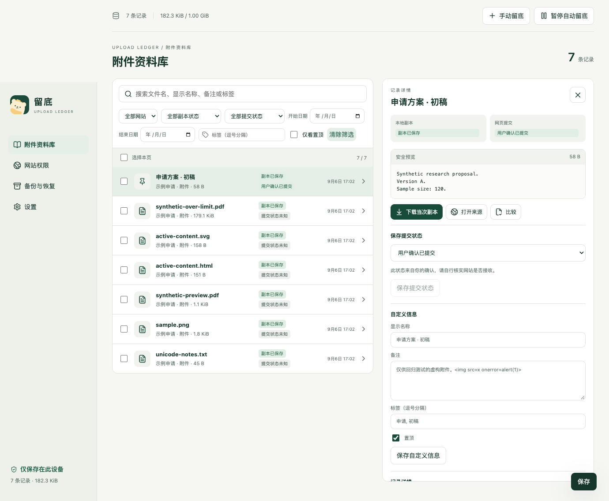
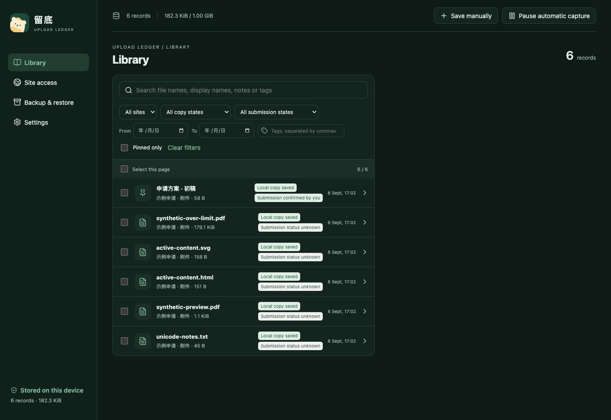

# 留底 · Upload Ledger

[](https://github.com/bocchitherock888-ux/upload-ledger/releases/latest)
[](https://github.com/bocchitherock888-ux/upload-ledger/actions/workflows/verify.yml)
[](https://github.com/bocchitherock888-ux/upload-ledger/releases)

[](LICENSE)

**找回你当时提交给网站的那份文件。**

留底是一款安装在电脑 Chrome 浏览器里的扩展工具。你在招聘网站投简历、在学校网站交作业，或在线填写申请表时，通常要点击「上传文件」「选择文件」之类的按钮，从电脑里选一份文件交给网站。这里的“附件”，就是这些 PDF 简历、Word 作业、报名照片等文件。

在对应网站开启留底后，你每次选择上传文件，留底都会尝试在浏览器里保存一份副本，同时记下选择时间和来源网站。看到「副本已保存」，就可以以后再回来查看或下载这一份。

例如，你周一上传了 `简历.pdf`，周三又修改了电脑上同名文件里的工作经历。留底保存的周一副本仍是修改前的内容；以后想确认当时投递的是哪个版本，就能按日期和网站找到它。



## 安装和第一次使用

1. 打开[下载页面](https://github.com/bocchitherock888-ux/upload-ledger/releases/latest)，在 Assets（下载文件）中下载名字以 `UploadLedger-` 开头的 ZIP 安装包，解压到一个准备长期保留的文件夹。
2. 在 Chrome 地址栏输入 `chrome://extensions`。开启右上角的「开发者模式」，点击「加载已解压的扩展程序」，选择刚才解压出来、包含 `manifest.json` 的文件夹。
3. 打开你要提交文件的网页，例如一份在线申请表。点击浏览器工具栏里的留底图标；图标收在拼图形状的「扩展程序」菜单里时，可以先在那里找到留底。
4. 在留底弹窗里点击「在此站点启用」，允许它访问这个网站。每个需要自动保存文件的网站都要单独开启。
5. 回到网页，照常点击网页自己的上传按钮，从电脑里选择文件。留底弹窗或「附件资料库」中出现「副本已保存」后，这份文件就存下来了。

留底在你选择文件时保存副本。网页是否提交成功，请查看网站给出的结果；资料库里的提交状态可以由你手动标记。

## 保存以后可以做什么

- **找回当时的版本**：从留底弹窗进入「附件资料库」，按文件名、来源网站或日期查找。即使电脑上的原文件后来改过内容或被删掉，已保存的副本仍可下载。
- **记住每份文件的用途**：给文件添加备注和标签，例如「秋季申请」「第二次补交」，也可以把常用记录置顶。
- **直接查看文件**：在资料库里预览文字、图片和 PDF。Word、Excel 等其他格式可以下载后，用电脑上的对应软件打开。
- **比较文本内容**：选两份文字文件，查看增加、删除和修改的内容。
- **主动保存一份文件**：点击「手动留底」，从电脑选择文件即可保存。这个操作可以随时使用。

界面支持简体中文、繁體中文和 English，可在设置里切换浅色、深色或跟随系统外观。



## 适用于哪些网页

自动留底用于“从电脑选择文件并上传给网站”的操作。招聘、作业提交、报名和申请系统中常见的文件选择按钮属于这类场景。网站上的正文、已有图片和别人提供的下载文件，需要自行另存。

部分网站使用特殊上传控件，可能无法自动保存。第一次在某个网站使用时，可以先选一份文件，确认资料库出现「副本已保存」；也可以使用「手动留底」。通过拖拽上传文件时，需要在这个网站的权限设置中另外开启「记录拖放文件」。

扩展适用于 Chrome 120 及以上的普通浏览窗口，具体网站的兼容情况可能不同。[使用指南](implementation/USAGE.md)列出了文件大小、预览和备份的详细说明。

## 文件存在哪里，怎样备份

副本保存在当前 Chrome 浏览器的资料中，电脑之间通过导出、导入备份来转移。每个文件最多保存 50 MiB，默认总容量为 1 GiB，可以在设置里调整。

在「备份与恢复」中点击「备份全部记录」，把下载的 ZIP 保存到自己选定的位置。换电脑时，先安装留底，再选择这个 ZIP 恢复文件和记录。

文件副本和备份 ZIP 均未加密。卸载扩展或清除浏览器资料会删除本地副本，因此重要文件请定期备份。

更新扩展时，先导出备份，再将新版本覆盖到原来的扩展文件夹，并在 `chrome://extensions` 中点击留底的重新加载按钮。继续使用原文件夹有助于保留扩展身份和已有资料。

## 开发

使用 Node 24，在仓库根目录运行：

```sh
cd app
npm ci
npm run build
npm test
```

浏览器回归见 [GitHub Actions](https://github.com/bocchitherock888-ux/upload-ledger/actions)。

## 许可与反馈

作者：**醉步羊**（Tipram）。

[MIT](LICENSE) · [第三方许可](THIRD_PARTY_NOTICES.md) · [反馈问题](https://github.com/bocchitherock888-ux/upload-ledger/issues)
